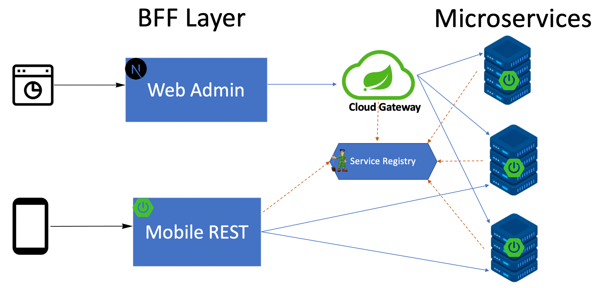

ChatABC system architecture demo
================================

A demo system architecture for ChatABC.

# Features

* BFF + MicroServices architecture
* DDD for MicroServices
* Spring Cloud ZooKeeper for service discovery

# Modules

* chatabc-api: API definitions for ChatABC, for example dubbo interface, http interface
* chatabc-service: MicroServices(DDD) for ChatABC to supply service interface, such as REST API, Dubbo service
* chatabc-admin(BFF): ChatABC admin REST API application
* chatabc-portal(BFF): ChatABC portal REST API application

# References

* Spring Boot: https://spring.io/projects/spring-boot
* ZooKeeper: https://zookeeper.apache.org/
* Spring Cloud ZooKeeper: https://cloud.spring.io/spring-cloud-zookeeper/reference/html/